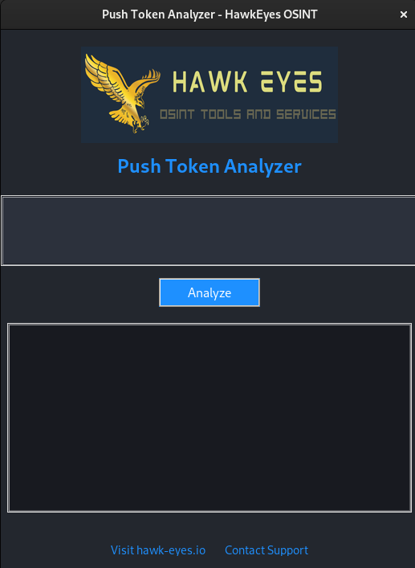
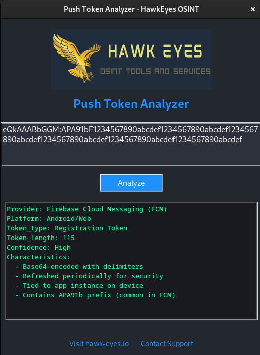

# Push Token Analyzer


## What is Push Token Analyzer?

**Push Token Analyzer** is a simple tool by [HawkEyes OSINT](https://hawk-eyes.io) that helps you identify and understand mobile push notification tokens.
You can use it to quickly check what type of push token you have (Apple, Android, etc.) and get details about it.

---

## Features

- Paste any push token and instantly see what it is.
- Supports Apple (APNs) and Android (FCM) tokens.
- Clean, easy-to-use interface.
- Works on Windows, Mac, and Linux.
- No internet connection required—your data stays private.

---

## Screenshots

**Main Window:**


**After Analyzing a Token:**


---

## How to Install and Run

### Step 1: Install Python

If you don't have Python installed, follow these steps:

1.  Go to the [Python Downloads page](https://www.python.org/downloads/).
2.  Download the installer for your operating system.
3.  Run the installer and follow the instructions.
    -   **Important:** Make sure to check the box that says "Add Python to PATH" during installation.

### Step 2: Download the Tool

1.  Download all the files from this repository.
2.  Extract the files to a folder on your computer.

### Step 3: Install Dependencies

1.  Open a terminal or command prompt.
    -   **Windows:** Press `Win + R`, type `cmd`, and press Enter.
    -   **macOS:** Open "Terminal" from the Applications/Utilities folder.
    -   **Linux:** Open your preferred terminal application.
2.  Navigate to the folder where you extracted the files using the `cd` command.
    -   For example: `cd /path/to/the/folder`
3.  Run the following command to install the required library:
    ```
    pip install pillow
    ```

### Step 4: Run the Tool

1.  In the same terminal or command prompt, run the following command:
    ```
    python push_token_gui.py
    ```

---

## Support

-   **Website:** [hawk-eyes.io](https://hawk-eyes.io)
-   **Email:** [customer_service@hawk-eyes.io](mailto:customer_service@hawk-eyes.io)

---

## FAQ

**Q: What is a push token?**
A: It’s a unique code used by mobile apps to send notifications to your device.

**Q: Is my data sent anywhere?**
A: No. All analysis happens on your computer. Nothing is uploaded or shared.

**Q: I get an error when running the script.**
A: Make sure you have installed Python and the required library (`pillow`).

---

## License

This tool is provided by HawkEyes OSINT.
See [LICENSE](LICENSE) for details.

---

**If you need more help, contact us at [customer_service@hawk-eyes.io](mailto:customer_service@hawk-eyes.io).**